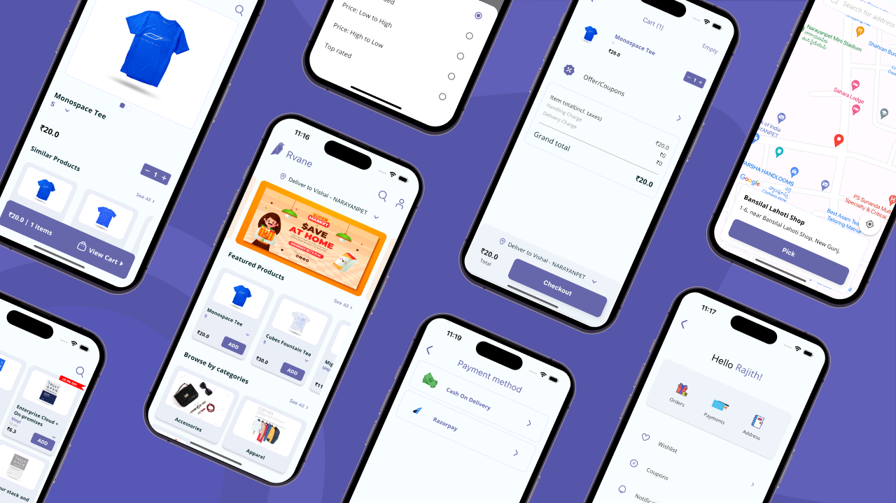
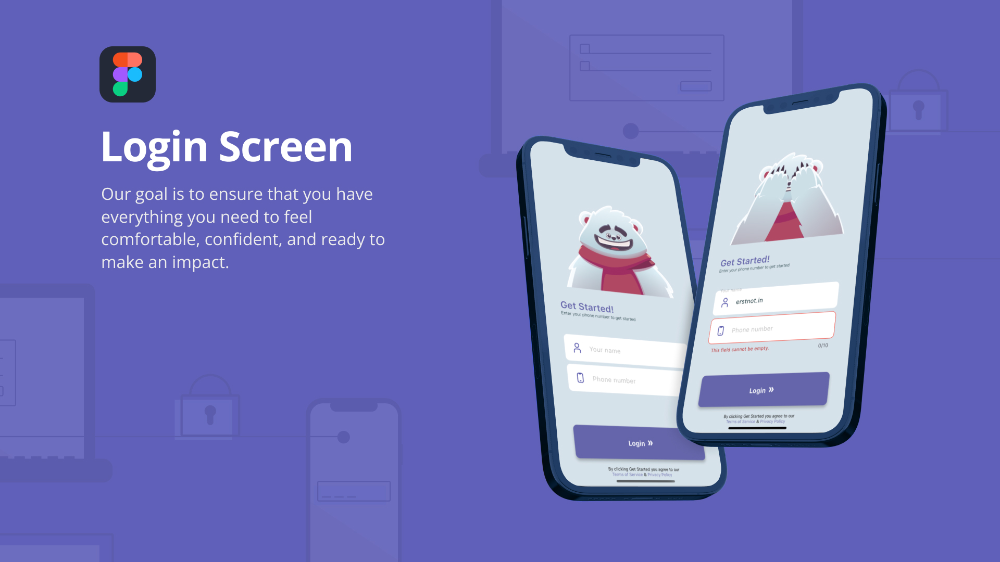

# Cybernate Retail a E-Commerce Flutter App

Welcome to our open-source E-Commerce Flutter app! This app is dedicated to delivering a seamless and lightning-fast shopping experience for food enthusiasts, offering a comprehensive platform to explore, purchase, and manage a variety of food products.

## Features

### User Authentication and Profile Management

- **Secure Authentication**: Users can sign up, log in securely, and reset passwords effortlessly.
- **User Profiles**: Manage personal information, addresses, and preferences with ease.

### Home Screen

- **Customizable Homepage**: Easily navigate through featured products, promotions, and personalized recommendations.
- **Quick Access**: One-tap access to categories, trending items, and recent searches for convenience.

### Product View

- **Immersive Product Display**: View products with high-resolution images and detailed descriptions for an engaging shopping experience.
- **Product Reviews & Ratings**: Access user reviews and ratings for better decision-making.

### Shopping Cart and Checkout

- **Instant Cart Updates**: Experience real-time updates when adding or removing items from the cart.
- **Seamless Checkout Process**: Enjoy a smooth and secure checkout flow with minimal load times.
- **Order Summary**: Quickly review and confirm orders before purchase.

### Checkout & Payment

- **Effortless Payment Methods**: Multiple payment options for convenient and secure transactions.
- **Payment Gateways Integration**: Securely process payments through various integrated gateways.

### Pick Address

- **Efficient Address Management**: Users can add, edit, and select delivery addresses hassle-free during checkout.
- **Saved Addresses**: Save frequently used addresses for faster order placement.

### Order Management & Tracking
- **Efficient Order Tracking**: Monitor orders in real-time with instantaneous updates on order status and expected delivery dates.
- **Cancellation and Refunds**: Easily initiate order cancellations and request refunds with minimal delay.

### Profile Management

- **Personalized Profiles**: Customize profiles and settings to suit individual preferences.
- **Order History**: Access detailed order history and track past purchases conveniently.

### GraphQL Integration
- **Optimized Data Fetching**: Utilizes GraphQL for lightning-fast and efficient data retrieval, ensuring a snappy user experience.
- **Real-time Updates**: Leverage GraphQL subscriptions for instantaneous updates on product availability and order status changes.

## Technologies Used

- **Flutter**: Employs Google's UI toolkit for building high-performance, natively compiled applications with a sleek and responsive UI.
- **MobX**: Implements efficient state management for a reactive and scalable application.
- **GraphQL**: Harnesses GraphQL's capabilities for rapid and optimized data fetching, providing a highly responsive user interface.

## Installation and Configuration

To set up and customize this project locally, refer to the instructions in the provided [Installation Guide](link_to_installation_guide). Adjust GraphQL endpoint URLs, API keys, and fine-tune the app's theme and branding to match your specific requirements for a seamless experience.

## Contributing

We welcome contributions! Review the guidelines outlined in the [Contribution Guidelines](link_to_contribution_guidelines) to ensure compliance with code standards and documentation requirements for new features or modifications.

## License

This project is licensed under the [MIT License](link_to_license), granting the freedom to modify, distribute, and utilize this app in accordance with the license terms.

## Acknowledgments

We express our gratitude to the dedicated developers, contributors, and supporters whose efforts have led to the creation and enhancement of this high-performing app.

## Contact Us 
rajith@erstnot.in or rajithjarang@gmail.com

